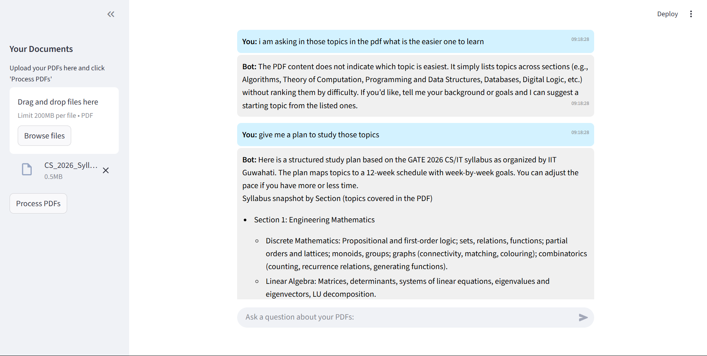

# 📚 Chat with Multiple PDFs (RAG + Streamlit + LLM)

## 🚀 Overview
This project is an **AI-powered PDF Q&A application** built with **Streamlit, LangChain, OpenAI, and FAISS**.  
It allows users to **upload multiple PDFs**, process them into embeddings, and then **chat with the documents** using natural language queries.

The system ensures that answers are **strictly derived from the uploaded PDFs**, preventing hallucinations by returning:
> "This question is not related to the uploaded PDFs."  
when asked something outside the context.

## How It Works


---

## ✨ Features
- 📂 Upload multiple PDFs simultaneously
- 🔍 Split documents into semantic chunks for better retrieval
- 🧠 Generate vector embeddings using OpenAI Embeddings
- ⚡ Store and retrieve embeddings via FAISS vectorstore
- 🤖 Chat interface powered by LangChain’s `ConversationalRetrievalChain`
- 🎨 Custom UI with **dark mode compatibility** for readability
- ⛔ Strict filtering – no hallucinated answers
- 🕒 Timestamped chat history for clarity

---

## 🛠️ Tech Stack
- [Streamlit](https://streamlit.io/) – UI framework  
- [LangChain](https://www.langchain.com/) – Orchestration for RAG pipeline  
- [OpenAI API](https://platform.openai.com/) – LLM + embeddings  
- [FAISS](https://faiss.ai/) – Vector database for similarity search  
- [PyPDFLoader](https://python.langchain.com/docs/modules/data_connection/document_loaders/pdf) – PDF document loader  

---

## ⚙️ How It Works
1. **Upload PDFs** – User uploads one or more PDFs via the sidebar.  
2. **Processing** – The PDFs are split into text chunks and embedded using OpenAI.  
3. **Vectorstore** – FAISS stores the embeddings for fast retrieval.  
4. **Chat** – User asks a question → system retrieves the most relevant chunks → LLM generates a contextual answer.  
5. **Response Filtering** – If the answer is not found in the documents, a strict fallback is triggered.  

---

## 💻 Installation

### 1. Clone the repository
```bash
git clone https://github.com/harsha-chichu/Talk-To-PDF.git
cd Talk-To-PDF
```

### 2. Create a virtual environment
```bash
python -m venv venv
source venv/bin/activate   # Mac/Linux
venv\Scripts\activate    # Windows
```

### 3. Install dependencies
```bash
pip install -r requirements.txt
```

### 4. Set up environment variables
Create a `.env` file and add:
```bash
OPENAI_API_KEY=your_openai_api_key
```

### 5. Run the app
```bash
streamlit run app.py
```

---

## 📸 Screenshots


---

## 🔮 Future Improvements
- ✅ Support for other file formats (Word, Excel, TXT)
- ✅ Option to download chat history
- ✅ Advanced filtering (multi-turn reasoning, hybrid search)
- ✅ Deployment on cloud (Streamlit Cloud, Vercel, Render, etc.)

---

## 👤 Author
**Harsha Vardhan**  
AI Engineer | Researcher | Builder of practical AI tools  
🔗 [LinkedIn](https://www.linkedin.com/in/harsha-vardhan12/) | [GitHub](https://github.com/harsha-chichu)

---

## ⭐ Contribute & Support
If you find this project helpful, give it a ⭐ on GitHub and share it with others!
